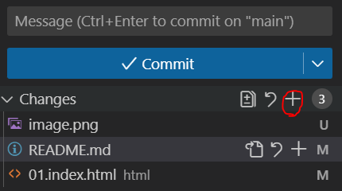

# Git

Para clonar repositorio, vamos al repositorio > Code > SSH y copiamos la URL (`git@... .git`)
```
  git clone <URL>
```

La primera vez que clonais os saldrá el aviso de que no hay un user configurado, entonces:

```
  git config --global user.name "<Nombre>"
```

Es recomendable que coloqueis el email de Github:
```
  git config --global user.email "<email>"
```
Para subir un cambio:
1. Abrir la carpeta en Code 👉(**la carpeta que habéis clonado antes**)
2. Hacéis un cambio en cualquier archivo 👉(**Guardad**)
3. Abrid el icono de control de cambios: 
4. Usamos el icono del + para añadir todo:

5. Escribimos un mensaje que explique qué hemos hecho
6. Commit & push

7. gg ez

---

## Referencias

- Para crear llave abrid CMD y ejecutad `ssh-keygen` > Enter hasta el final y la llave estará en una ruta que sale en uno de estos pasos, algo como `C:\Users\<tu_usuario>/.ssh/id_rsa.pub` en Windows y algo como `/home/<usuario>/.ssh` en Linux. En Mac (wip)
- https://docs.github.com/es/authentication/connecting-to-github-with-ssh/adding-a-new-ssh-key-to-your-github-account
